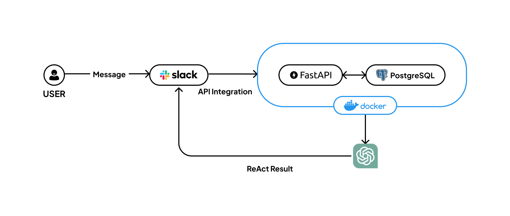

<h1 align="center"> Please Just Texting</h1>
<p align="center">A repository dedicated to promoting text-based communication, discouraging the use of images or other media. Ideal for those who prefer simplicity and clarity in their exchanges.</p>

<p align="center"></p>

## Getting Started

### Installation

Run the following:

```bash
make
```

## Architecture



## Tech Stack

This project is built with:

| Category               | Technologies         |
| :--------------------- | :------------------- |
| **Framework**          | FastAPI, Jinja2      |
| **Database**           | MySQL, Alembic       |
| **Contrainerization**  | Docker               |
| **Code Quality Tools** | black, flake8, isort |
| **Data Validation**    | Pydantic             |

## Linting

This project uses linting solution as follows:

| Name   | Description                           |
| :----- | :------------------------------------ |
| black  | Automated Python code styler.         |
| flake8 | PEP8 based Python code style checker. |
| isort  | Python import packages order checker. |
| mypy   | Python type checking tool.            |

### How to use lint

**black**

```bash
black . --fix
```

**flake8**

```bash
flake8 .
```

**isort**

```bash
isort .
```

**mypy**

```bash
mypy .
```
